# Course protocol

# Sequencing Pipeline

To go from raw data produced by a sequencer to a completed genome many steps are needed. These steps can be summarized under the term "sequencing pipeline" and are described below. In each step, the data is processed and the output is used as input for the next step. 
By utilizing batch scripts to run the pipeline on a cluster, it is possible to run commands on multiple samples at the same time. In addition, the resources provided by the cluster decrease the time it takes to run the scripts significantly.

## Cluster
The cluster is a high performance computer linked to the internet, it is used to run computationally intensive programs. To use the cluster, you need to connect to it using a terminal. Then you can run commands on the cluster, for example Bash scripts. The commands are sent to the cluster and the cluster runs the commands. The results are then sent back to your computer. 

Important commands:
- `ssh -X username@clustername` - Connect to the cluster
- `sbatch batch_name` - Run a Batch script on the cluster
- `squeue -u username` - Check the status of the jobs on the cluster
- `scancel job_id` - Cancel a job on the cluster
- `sinfo` - Check the status of the cluster
- `exit` - Disconnect from the cluster

## Batch scripts
Batch scripts are Bash scripts that are run on the cluster. The scripts are used to run commands on multiple samples at the same time. The Format is `script_name.sh`. At the beginning of the script, you need to specify the resources you need to run the script, as well as the output name. 
An example of a batch script is shown below. 

```
#!/bin/bash
#SBATCH -J job_name
#SBATCH -o job_name.out
#SBATCH -e job_name.err
#SBATCH -p short
#SBATCH -n 1
#SBATCH -t 0-00:30
#SBATCH --mem=100
#SBATCH --nodelist=node002

´whatever commands you want to run´
```
These lines specify:
- the name of the job
- the name of output and error files
- the partition
- the number of cores
- the time limit 
- the memory limit
- the node to run the job on

The partition is the queue on the cluster. The time limit is the maximum time the job can run. The memory limit is the maximum amount of memory the job can use.

To run the script, you need to use the command `sbatch script_name.sh`. The script will then be run on the cluster. The output and error files will be created in the directory where the script is located. The output file contains the output from the script. The error file contains the error messages from the script. The input and output directories for the data can be specified in the script.

There are several batch file extensions for different programming languages:
- `.sh` - shell script
- `.py` - python script
- `.R` - R script

After submitting the script, you can check the status of the job using the command `squeue -u username` or cancel the job using the command `scancel job_id`.

## Conda environment
The sequencing pipeline uses many programs and packages. To make sure that these programs are installed correctly, it is recommended to use a conda environment. A conda environment is a virtual environment that contains all the programs and packages needed to run the pipeline. 
- To create a conda environment, you need to use the command `conda create -n environment_name`. 
- To activate the environment, you need to use the command `conda activate environment_name`. 
- To install a program in the environment, you need to use the command `conda install program_name`. 
- To deactivate the environment, you need to use the command `conda deactivate`.

It might be necessary to install additional modules to run the programs. For example, to run fastqc, you need to install the module **fastqc**. To install a module, you need to use the command `module load module_name`.

To adjust the parameters of the programs correctly, it is recommended to read the documentation of the programs. The documentation can be found on the internet or by using the command `program_name --help`.

Look for the following information:
- input file
- output file
- essential parameters
- optional parameters
- required modules

## Sequencing pipeline
### Overview of the sequencing pipeline
1. Raw data
2. Quality control / Trimming
3. Assembly
4. Binning
5. MAGs Quality assessment
6. Bin refinement
7. Taxonomic classification


## 1. Raw data
- Raw data is the output from the sequencer.
- File format **FASTQ** (example file: SRR2584869_1.fastq.gz)
- The file contains four lines for each DNA fragment:
  -  The first line contains the fragment ID. (optional information like length)
  -  The second line contains the DNA sequence. 
  -  A separator, which is simply a plus (+) sign. (optional fragment ID) 
  -  The fourth line contains the quality score for each nucleotide in the DNA sequence. 
  
  The quality score is a number between 0 and 40 encoded in ASCII format. The higher the number, the higher the quality of the nucleotide. The quality score is calculated by the sequencer, it is used to filter out low quality nucleotides. 
  
  An example of a FASTQ file is shown below. 
  ```
  @SEQ_ID
  GATTTGGGGTTCAAAGCAGTATCGATCAAATAGTAAATCCATTTGTTCAACTCACAGTTT
  +
  !''*((((***+))%%%++)(%%%%).1***-+*''))**55CCF>>>>>>CCCCCCC65
  ```


## 2. Quality control / Trimming
- The quality of the DNA fragments is checked.
- The DNA fragments are trimmed to remove low quality nucleotides.
- The DNA fragments are filtered to remove fragments with too many low quality nucleotides.

The following programs are used:

- **Fastqc** is a program that checks the quality of the DNA fragments. It creates a report that contains information about the quality of the DNA fragments. The report is used to decide which parameters to use for trimming and filtering.

  - Command: **[fastqc](https://home.cc.umanitoba.ca/~psgendb/doc/fastqc.help)**
  - Input file: `fastq` 
  - Output: report.`HTML`

  <details>
  <summary>Expand to see the documentation of fastqc</summary>

  fastqc accepts the following parameters:
    - `-o` - output directory
    - `-t` - number of threads
    - `-f` - file format
    - `-k` - kmer size
    - `-q` - quiet mode
    - `-c` - number of files to process in parallel
    - `-noextract` - do not extract the compressed file
    - `-nogroup` - do not create a summary report
    - `-nozip` - do not zip the output file
    - `-threads` - number of threads to use
    - `-format` - file format
    - `-kmers` - kmer size
    - `-quiet` - quiet mode
    - `-contaminants` - contaminants file
    - `-adapters` - adapters file
    - `-extract` - extract the compressed file
    - `-n` - number of files to process in parallel
    - `-s` - summary report
    - `-z` - zip the output file
    - `-h` - help
    - `-v` - version

  [Full documentation](https://home.cc.umanitoba.ca/~psgendb/doc/fastqc.help)

  example: 
  ```
  #essential (input file is in the current directory):
  fastqc input_file

  #optional:
  fastqc PATH/TO/input_file -o PATH/TO/output_directory -t 4 -f fastq -k 7 -q -c 4 -threads 4 -kmers 7 -n 4  
  ```
  </details>

  [Batch script used in course](https://github.com/YanGiencke/biol217/blob/72f605574bbcf429966ff1d4bbc13783ace20703/scripts/assemblyscript.sh)


- **Fastp** is a program that trims and filters the DNA fragments. It can be used to trim the DNA fragments to a specific length, to remove low quality nucleotides from the beginning and end of the DNA fragments, and to remove DNA fragments with too many low quality nucleotides. The parameters for trimming and filtering are specified in the batch script. The output of fastp is a fastq file with the trimmed and filtered DNA fragments.

  - Command: **[fastp](https://github.com/OpenGene/fastp#fastp)**
  - Input file: `fastq` (+ information from report.`HTML`)
  - Output file: `fastq`

  [Batch script used in course](https://github.com/YanGiencke/biol217/blob/main/scripts/fastpscript.sh)


## 3. Assembly
- The DNA fragments are assembled into contigs.
- Quality assessment of the contigs.
  - Visualization of the contigs.
  - Analysis of metadata.

To assemble the DNA fragments into contigs, the program **[megahit](https://github.com/voutcn/megahit)** is used.
- Command: **[megahit](https://github.com/voutcn/megahit)**
- Input: `R1_fastq` + `R2_fastq` (trimmed and filtered by fastp)
- Output: `fa` (fasta)

  [Batch script used in course](https://github.com/YanGiencke/biol217/blob/main/scripts/assemblyscript.sh)


To visualize the contigs, you can use the program **[Bandage](https://rrwick.github.io/Bandage/)**. For this you need to convert the fasta file to a fastg file.

- Command: **[megahit_toolkit contig2fastg](https://github.com/voutcn/megahit)**
- Input: `fa` (fasta)
- Output: `fastg`

  example:
  ``` 
  megahit_toolkit contig2fastg 99 -i input_file.fa -o output_file.fastg
  ```
    [Batch script used in course](https://github.com/YanGiencke/biol217/blob/main/scripts/contig2fastgcscript.sh)

  The following image shows the visualisation of the contigs using Bandage. The contigs are sorted by length.
  
  
  

A quick way to count the number of contigs in a fasta file is to use the following code:
  ```
  grep -c ">" final.contigs.fa
  ```
Qualty assessment of the contigs is done using **[quast](https://quast.sourceforge.net/quast.html)**. It creates a report that contains information about the contigs. The report is used to decide which parameters to use for binning or reassembly.

  - Command: **[quast](https://quast.sourceforge.net/quast.html)**
  - input: `fa` (fasta)
  - output: `HTML` (report)

    [Batch script used in course](https://github.com/YanGiencke/biol217/blob/main/scripts/metaquastscript.sh)

**Questions to assembly:**

    - What is your N50 value? Why is this value relevant? 
    The N50 value is 2961. This value shows the length of the contigs that are needed to cover half of the total length of the contigs.

    - How many contigs are assembled?
    56057

    - What is the total length of the contigs?
    142162752


## 4. Binning
The binning is done in the following steps:
  - Mapping of the contigs as preparation for binning.
  - Binning
    - Refference based
    - De-Novo by differential coverage
  - Bin refinement
  - Bin reassembly

### Preparation (mapping of the contigs)
Binning is done in the [anvi'o](https://anvio.org/) environment, which requires a specific file format. To convert the fasta file to the anvi'o file type, the following command is used:

  - Command: **[anvi-script-reformat-fasta](https://anvio.org/help/main/programs/anvi-script-reformat-fasta/)**
  - Input: `fa` (fasta)
  - Output: `fa` (fasta anvi'o)

    [Batch script used in course](https://github.com/YanGiencke/biol217/blob/main/scripts/anvio_reformat.sh)


Mapping of the contigs is done using **[bowtie2]( http://bowtie-bio.sourceforge.net/bowtie2/index.shtml)**. Here the raw reads are mapped onto our assembled contigs.
  First the index of the contigs is created:

  - Command: **[bowtie2-build]( http://bowtie-bio.sourceforge.net/bowtie2/index.shtml)**
  - Input: `fa` (fasta anvi'o)
  - Output: `bt2` (bowtie2 index)

    [Batch script used in course](https://github.com/YanGiencke/biol217/blob/main/scripts/bowtie2_build.sh)


  Then the raw reads are mapped onto the contigs:
  - Command: **[bowtie2]( http://bowtie-bio.sourceforge.net/bowtie2/index.shtml)**
  - Input: `bt2` (bowtie2 index) + `fq` (fastq trimmed)
  - Output: `sam` (sequence alignment map)

      [Batch script used in course](https://github.com/YanGiencke/biol217/blob/main/scripts/mappingscript.sh)

  The mapping results are converted to a binary alignment map (bam) file:
  - Command: **[samtools view]( http://www.htslib.org/)**
  - Input: `sam` (sequence alignment map)
  - Output: `bam` (binary alignment map)

    [Batch script used in course](https://github.com/YanGiencke/biol217/blob/main/scripts/sam2bam.sh)

  The bam file is sorted and indexed:
  - Command: **[anvi-init-bam]( https://anvio.org/help/main/programs/anvi-init-bam/)**
  - Input: `bam` (binary alignment map)
  - Output: `bam` (sorted) + `bam.bai` (index)

    [Batch script used in course](https://github.com/YanGiencke/biol217/blob/main/scripts/sort_index_bam.sh)

Next we create a contigs database which holds important information about the contigs. The program **[anvi-gen-contigs-database](https://merenlab.org/2016/06/22/anvio-tutorial-v2/#creating-an-anvio-contigs-database)** computes the k-mer frequencies and identifies open reading frames (ORFs) using [Prodigal](https://github.com/hyattpd/Prodigal). On the created contigs database, we perform a search for hidden Markov models (HMMs) using [anvi-run-hmms](https://anvio.org/help/7/programs/anvi-run-hmms/).

 This is done using the following command:
  - Command: **[anvi-gen-contigs-database](https://merenlab.org/2016/06/22/anvio-tutorial-v2/#creating-an-anvio-contigs-database)** + **[anvi-run-hmms](https://anvio.org/help/7/programs/anvi-run-hmms/)**
  - Input: `fa` (fasta anvi'o)
  - Output: `db` (contigs database) 

    [Batch script used in course](https://github.com/YanGiencke/biol217/blob/main/scripts/contigdbscript.sh)

Creating anvi'o profiles:
  - Command: **[anvi-profile](https://merenlab.org/2016/06/22/anvio-tutorial-v2/#creating-an-anvio-profile)**
  - Input: `bam` (sorted) + `db` (contigs database)
  - Output: `db` (anvi'o profile)

    [Batch script used in course](https://github.com/YanGiencke/biol217/blob/main/scripts/anvio_profile.sh)

Merging the anvi'o profiles:
  - Command: **[anvi-merge](https://merenlab.org/2016/06/22/anvio-tutorial-v2/#merging-anvio-profiles)**
  - Input: `db` (anvi'o profiles)
  - Output: `db` (merged profile)

    [Batch script used in course](https://github.com/YanGiencke/biol217/blob/main/scripts/anvi_merge.sh)


### Binning
Now the actual binning is done using [Metabat2](https://bitbucket.org/berkeleylab/metabat/src/master/ ) and [CONCOCT](https://github.com/BinPro/CONCOCT ), afterwards we choose the best bins by running the [DAS_Tool](https://github.com/cmks/DAS_Tool ).

  - Command: **[anvi-cluster-contigs](https://anvio.org/help/main/programs/anvi-cluster-contigs/)**
  - Input: `db` (merged profile + contigs database)
  - Output: `db` (bins database)+ `html` (interactive report) + `fa` (fasta)
  
  Metabat2 binning:
  - requires the additon of --driver metabat2 to the anvi-cluster-contigs command

    [Batch script used in course](https://github.com/YanGiencke/biol217/blob/main/scripts/metabat2.sh)

  CONCOCT binning: 
  - requires the additon of --driver concoct to the anvi-cluster-contigs command
  
    [Batch script used in course](https://github.com/YanGiencke/biol217/blob/main/scripts/concoct.sh)

  DAS_Tool for consolidating the bins:
  - requires the additon of --driver das_tool to the anvi-cluster-contigs command

    [Batch script used in course](https://github.com/YanGiencke/biol217/blob/main/scripts/dastool.sh)


**Questions to the binning:**

    Number of Archaea bins you got from MetaBAT2?
    3 of 48 bins

    Number of Archaea bins you got from CONCOCT?
    2 of 156 bins 

    Number of Archaea bins you got after consolidating the bins?
    2 of 41 bins


## 5. MAGs Quality assessment
- The quality of the bins is assessed.
- The completeness and contamination of the genomes are estimated.
types of contamination:
  - redundant sequences (parts are covered multiple times)
  - chimeric sequences (contamination by other organisms)
  - both redundant and chimeric sequences

These steps can be done with the generated html file from the binning step (anvi-summarize). Alternatively, we can use Anvi'o's interactive interface.

**Questions to the quality assessment:**

    Which binning strategy gives you the best quality for the Archaea bins??
    Metabat2

    How many Archaea bins do you get that are of High Quality? 
    2 Archaea bins

    How many Bacteria bins do you get that are of High Quality?
    30 Bacteria bins


## 6. Bin refinement
- The bins are refined to remove redundancy and chimeric sequences.
  - Automatic using GUNC
  - Manual bin refinement	using Anvi'o's interactive interface

  To detect chimeric bins, we use the program [GUNC](https://grp-bork.embl-community.io/gunc/). The program is run on the fasta file of the Archaea bins. Only the non chimeric bins pass the GUNC filter.

  [Batch script used in course](https://github.com/YanGiencke/biol217/blob/main/scripts/gunc.sh)

**Questions to the bin refinement:**

    Do you get Archaea bins that are chimeric? 
    Yes, we get chimeric bins from the concoct binning.
    A low css score indicates that the bin is not chimeric.

    In your own words (2 sentences max), explain what is a chimeric bin.
    A chimeric bin is a bin that includes sequences from multiple organisms of different species. 

  Afteer sorting out the chimeric bins wit GUNC, we can use Anvi'o's interactive interface to refine the bins manually. 

  To access the interactive interface, we use the following commands directly in the terminal:

```	
#To request a node
srun --reservation=biol217 --pty --mem=10G --nodes=1 --tasks-per-node=1 --cpus-per-task=1 --nodelist=node### /bin/bash

#To activate the anvio environment
conda activate /home/sunam225/miniconda3/miniconda4.9.2/usr/etc/profile.d/conda.sh/envs/anvio-7.1

#To start the interactive interface with specific command
anvi-refine -c /PATH/TO/contigs.db -C consolidated_bins -p /PATH/TO/merged_profiles/PROFILE.db --bin-id Bin_METABAT__25
```

In a new terminal window:

```
#Login to the cluster
ssh -L 8060:localhost:8080 sunam###@caucluster-old.rz.uni-kiel.de

#Access the previously requested node
ssh -L 8080:localhost:8080 node###
```	

In google Chrome, we can now access the interactive interface with http://127.0.0.1:8060 .

In the interactive interface, we sort the bins by differerential coverage and remove potential chimeric sequences.

**Questions to the bin refinement:**

    Does the quality of your Archaea improve?
      Completeness before: 97,4% 
      Completeness after: 93,4%
      The redundancy stays the same: 5,3%
      Although the completeness decreased,  the bin is improved because we removed potential chimeric sequences.
    
    How abundant are the Archaea bins in the 3 samples?
      BGR_130708: 0.58
      BGR_130527: 1.14
      BGR_130305: 1.76

    Submit your output Figure


## 7. Taxonomic classification
Now we add taxonomic annotations to the MAG. This allows us to see present single copy genes and estimate the microbial composition of our metagenome.
In this step we run the following programs in a batch script:
  - Command: **[anvi-run-scg-taxonomy](https://anvio.org/help/main/programs/anvi-run-scg-taxonomy/)**
  - Command: **[anvi-estimate-scg-taxonomy](https://anvio.org/help/main/programs/anvi-estimate-scg-taxonomy/)**
  - Command: **[anvi-summarize](https://anvio.org/help/main/programs/anvi-summarize/)**

    [Batch script used in course](https://github.com/YanGiencke/biol217/blob/main/scripts/taxonomy.sh)

**Questions to the taxonomic classification:**

    Did you get a species assignment to the Archaea bins previously identified?
      Metabat2: Methanoculleus sp012797575
      CONCOCT: Methanosarcina flavescens

    Does the HIGH-QUALITY assignment of the bin need revision?
      Yes, a manual quality check using blast. And further refinement of the bins is necessary.


# Pangenomics
The aim of pangenomics is to compare the assembled MAGs to reference genomes to gain insight into the underlying phylogenetics and functional potential of the MAGs.

## Pangenoimcs workflow
1. Evaluate the contig databases
2. Create a pangenome database
3. Compare the databases using ANI
4. Visualize the results
5. Interpretation of the results


## 1. Evaluate the contig databases
For evaluation if the contig databases we use Anvio interactive interface. We can use the following commands to access the interface:
 
```
#get direct access to a HPC compute node
srun --reservation=biol217 --pty --mem=10G --nodes=1 --tasks-per-node=1 --cpus-per-task=1 /bin/bash

#activate the conda environment
conda activate /home/sunam225/miniconda3/miniconda4.9.2/usr/etc/profile.d/conda.sh/envs/anvio-7.1

#move to working directory
cd /path/to/

# start anvi'o interactive display(-P set the port)
anvi-display-pan -g *-GENOMES.db -p *-PAN.db -P 8089

# start tunnel in new Terminal(adjust port from pevious step & node)
ssh -L 8060:localhost:8089 sunam230@caucluster-old.rz.uni-kiel.de
ssh -L 8089:localhost:8089 node010

#open with link in browser:
http://127.0.0.1:8060
```

Task: Take some time to click through the views and compare the MAGs. Add a screenshot of your output to your documentation. Answer the following Questions:

Question: How do the MAGs compare in size and number of contigs to the full genome?

Answer: The MAGs are much shorter. For example N50 shows the average length of fragments in different Bins. Here "Methano_Bin13: 22,585" is much better than "Methano_Bin5: 4,826"

|Contigs Stats|	Methano_Bin10	| Methano_Bin13|	Methano_Bin1|	Methano_Bin3	|Methano_Bin5|	Methano_Bin8|	Methano_Bin9|	Methano_Mflavescens|
|----|----|----|----|----|----|----|----|----|
|N50|	4,894|	22,585|	5,434|	13,114|	4,826|	19,343|	13,691|	3,283,688|

Question: Based on the contig numbers, sizes and number of marker genes (HMM hits), which two MAGs are the best and which is the worst?

Answer: 

|MAGs | Number of contigs| Size of contigs	| Number of marker genes|
|----|----|----|----|
|Best | Methano_Bin13 | Methano_Bin13 | Methano_Bin13 |
|Worst | Methano_Bin5 |Methano_Bin10 | Methano_Bin5 |


## 2. Create a pangenome database
In this step we create a pangenome database from the MAGs. We use the following commands:

### Create an external genomes file:

```
anvi-script-gen-genomes-file --input-dir ? -o external-genomes.txt
```

The created file external-genomes.txt can be accessed in the terminal:
  
  ```
external-genomes.txt

name	contigs_db_path
Methano_Bin1	/work_beegfs/sunam230/Day6/02_contigs-dbs/Bin1.db
Methano_Bin10	/work_beegfs/sunam230/Day6/02_contigs-dbs/Bin10.db
Methano_Bin13	/work_beegfs/sunam230/Day6/02_contigs-dbs/Bin13.db
Methano_Bin3	/work_beegfs/sunam230/Day6/02_contigs-dbs/Bin3.db
Methano_Bin5	/work_beegfs/sunam230/Day6/02_contigs-dbs/Bin5.db
Methano_Bin8	/work_beegfs/sunam230/Day6/02_contigs-dbs/Bin8.db
Methano_Bin9	/work_beegfs/sunam230/Day6/02_contigs-dbs/Bin9.db
Methano_Mflavescens	/work_beegfs/sunam230/Day6/02_contigs-dbs/Mflavescens.db
  ```

### Estimate genome completeness
  
  ```
  anvi-estimate-genome-completeness -e external-genomes.txt > genome-completeness.txt
  ```

Question: How do the bins compare to isolate genomes? Would you remove one, based on the output of the completeness estimation?

ANSWER:
Bin10 & Bin5 are below 70% completeness so we remove them.
external-genomes-final.txt

```	
╒═════════════════════╤══════════╤══════════════╤════════════════╤════════════════╤══════════════╤════════════════╕
│ genome name         │ domain   │   confidence │   % completion │   % redundancy │   num_splits │   total length │
╞═════════════════════╪══════════╪══════════════╪════════════════╪════════════════╪══════════════╪════════════════╡
│ Methano_Bin1        │ ARCHAEA  │          0.8 │          86.84 │           5.26 │          275 │        1375677 │
├─────────────────────┼──────────┼──────────────┼────────────────┼────────────────┼──────────────┼────────────────┤
│ Methano_Bin10       │ ARCHAEA  │          0.3 │          56.58 │              0 │          286 │        1336430 │
├─────────────────────┼──────────┼──────────────┼────────────────┼────────────────┼──────────────┼────────────────┤
│ Methano_Bin13       │ ARCHAEA  │            1 │            100 │           5.26 │          182 │        2194666 │
├─────────────────────┼──────────┼──────────────┼────────────────┼────────────────┼──────────────┼────────────────┤
│ Methano_Bin3        │ ARCHAEA  │          0.9 │          96.05 │           3.95 │          180 │        1769119 │
├─────────────────────┼──────────┼──────────────┼────────────────┼────────────────┼──────────────┼────────────────┤
│ Methano_Bin5        │ ARCHAEA  │          0.3 │          43.42 │              0 │          334 │        1582595 │
├─────────────────────┼──────────┼──────────────┼────────────────┼────────────────┼──────────────┼────────────────┤
│ Methano_Bin8        │ ARCHAEA  │          0.9 │          93.42 │           6.58 │          145 │        1795577 │
├─────────────────────┼──────────┼──────────────┼────────────────┼────────────────┼──────────────┼────────────────┤
│ Methano_Bin9        │ ARCHAEA  │          0.8 │          78.95 │           2.63 │          255 │        2637263 │
├─────────────────────┼──────────┼──────────────┼────────────────┼────────────────┼──────────────┼────────────────┤
│ Methano_Mflavescens │ ARCHAEA  │            1 │          94.74 │              0 │          164 │        3283688 │
╘═════════════════════╧══════════╧══════════════╧════════════════╧════════════════╧══════════════╧════════════════╛
```

### Remove unwanted genomes
We remove the genomes with low completeness (<70%) and high redundancy (>10%) from the contigs directory and re-create the external-genomes file.

```
anvi-script-gen-genomes-file --input-dir ? -o external-genomes-final.txt
```

### Create a pangenome database

For the pangenome analysis we need to create two databases:
  - [genomes-storage.db](https://anvio.org/help/7/artifacts/genomes-storage-db/) which contains:
    - all genome fasta files
    - the gene annotations (HMMs, SCGs) 
    - genome comparisons
  
  - [pan-genome.db](https://anvio.org/help/main/programs/anvi-pan-genome/) which contains:
    - genome similarities based on gene amino acid sequences
    - resolved gene clusters
    - any post-analysis of gene clusters, downstream analyses and visualisations


    [Batch script used in course](https://github.com/YanGiencke/biol217/blob/main/scripts/anvi_genomes.sh)


## 3. Compare the databases using ANI
In this step we use the [anvi-compute-genome-similarity](https://anvio.org/help/main/programs/anvi-compute-genome-similarity/) command to compare the genomes in the genomes-storage.db database. The resulting file shows the similarity between all genomes in the database.

    [Batch script used in course](https://github.com/YanGiencke/biol217/blob/main/scripts/similarity.sh)


## 4. Visualize the results
For visualisation we use the interactive interface of anvi'o. It is stated a described above, however we use the command:
```
anvi-display-pan -p Biol217/Biol217-PAN.db -g Methanogen-GENOMES.db -P 8089
```
Task: Scroll to the top of the help and find out which INPUT FILES you need. Write the command and use the additional flag -P. What is the -P flag for?

Answer:  
    INPUT: -p Pan-Genome.db -g Combined-Genomes.de 
    -P sets the port example: 8089


## 5. Interpretation of the results
The interactive interface of anvi'o is very powerful and allows you to explore the results of your analysis. We will use it to explore the results of the pangenome analysis.

Anvio interactive Tasks: 
### Genome similarity

- Remove combined homogeneity, functional homogeneity, geometric homogeneity, max num parsimonay, number of genes in gene cluster and number of genomes gene cluster has hits from the active view. Tip: Play with Height
- Create a "Bin-highlight" including alls SCGs and name it accordingly. How to?

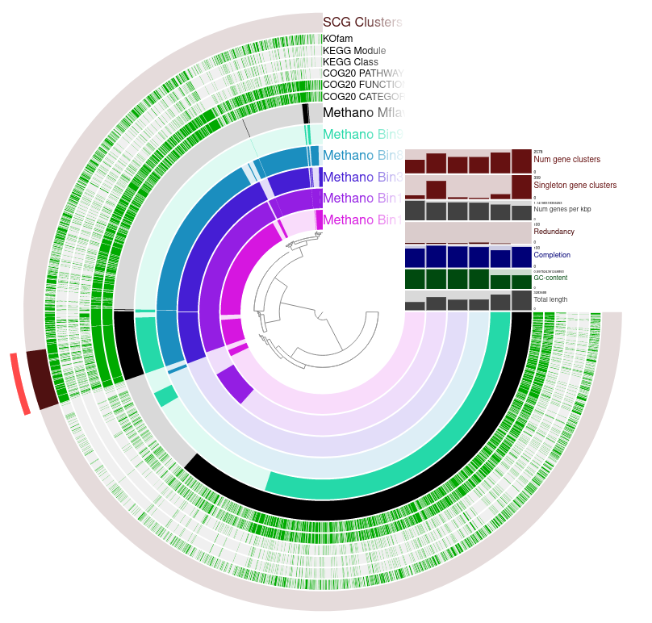


- Cluster the genomes based on Frequency
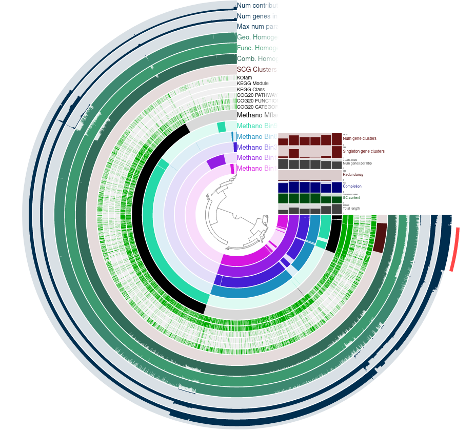

- Question: 
  - Based on the frequency clustering of genes, do you think all genomes are related? Why?
  - Highlight your reference genome in one color, its closest relative in a similar one, and distict genomes in a third colour.
  - How does the reference genome compare to its closest bin? Tip: Consider the genome depiction and layers above

Answer: No. Only Bin 9 is closely related to the reference Methano Mflavescens. The other Bins are related to each other.

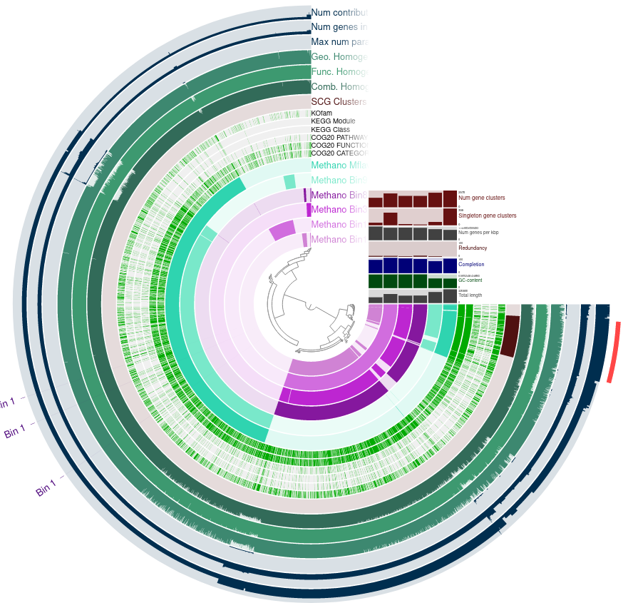


- Go to Layers and remove Num gene clusters, Singeltons, Genes per kbp and Total length from view. Add ANI_percentage_identity to the view and play with the threshold.

- Questions: What ranges are used determine a prokaryotic species? How high can you go until you see changes in ANI? What does the ANI clustering tell you about genome relatedness?

    Answer: 
    - over 95% identity for DNA from one species
    - differences between the two clusters appear upwards from 98%
    - The higher the saturation of a tupel, the higher the relatedness of the two Bins

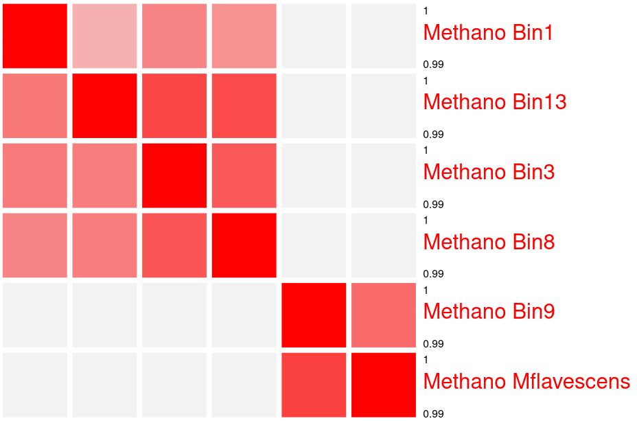


### TASKS: Functional Profiling

- Using the Search Function, highlight all genes in the KEGG Module for Methanogenesis
    - Create a new bin called "Methanogenesis" and store your search results in this bin.
    - Question: How are Methanogenesis genes distributed across the genome?

    Answer: Through the whole Pangenome.

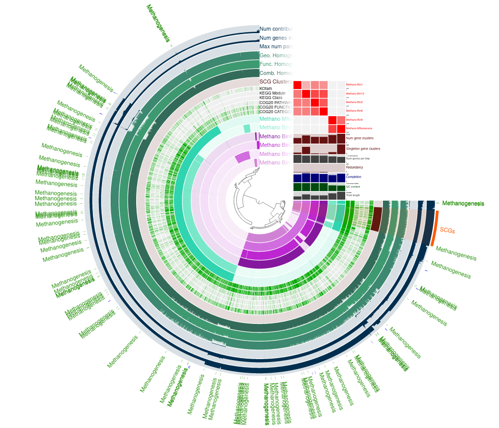


- Google COG Categories and select one you are interesed in. Create a new bin, find your Category in the Pangenome and add it to this selection.

    T - COG0642 - Signal transduction histidine kinase
    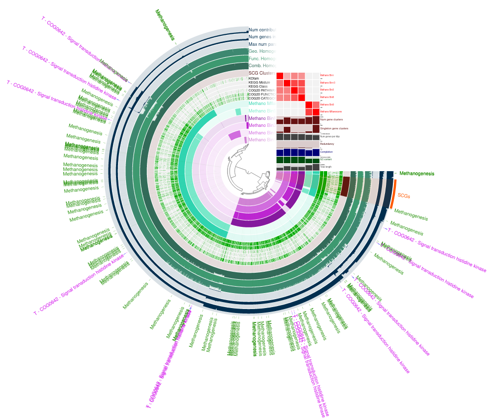


- Save your state and export this view as .svg

[pangenome.svg](resources/pangenome.svg)


### TASKS: Functional/geometric homogeneity and their uses

- Using search parameters, find a gene which occurs:
    - in all genomes
    - a maximum of 1 times (Single copy gene)
    - has a high variability in its functional homogeneity (max. 0.80)

    This gene will be highly conserved, but has diversified in its AA make-up.

    Highlight the found genes on the interface. Inspect one of the gene-clusters more closely (Inspect gene-cluster).
    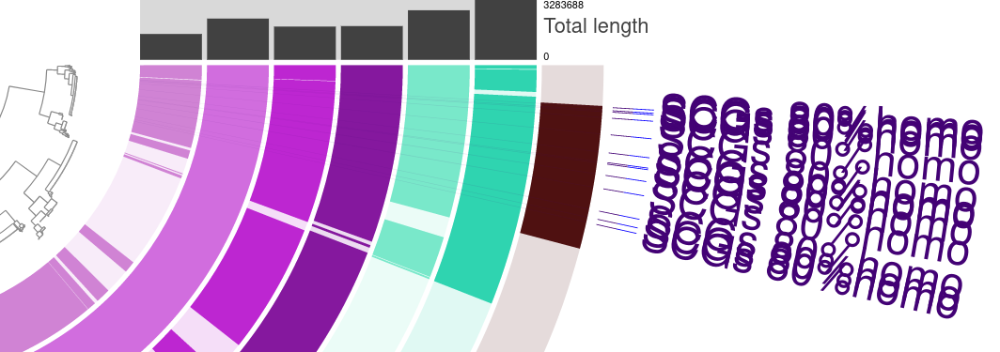


Question: What observations can you make regarding the geometric homogeneity between all genomes and the functional homogeneity?

The AA sequences start later in some Bins these are not geometrically homogenous
    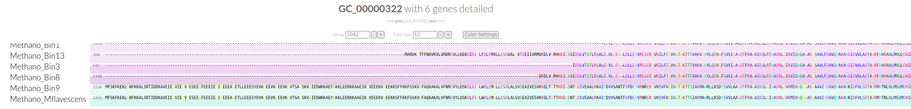


### BONUS: BlastKoala

Outside of anvi'o there are a range of tools available to investigate your organisms metabolism. One of these is BlastKOALA, which generates a metabolic profile of your genome based on the KEGG database.

- Task: Check out the BlastKOALA Results for this Methanogen.
    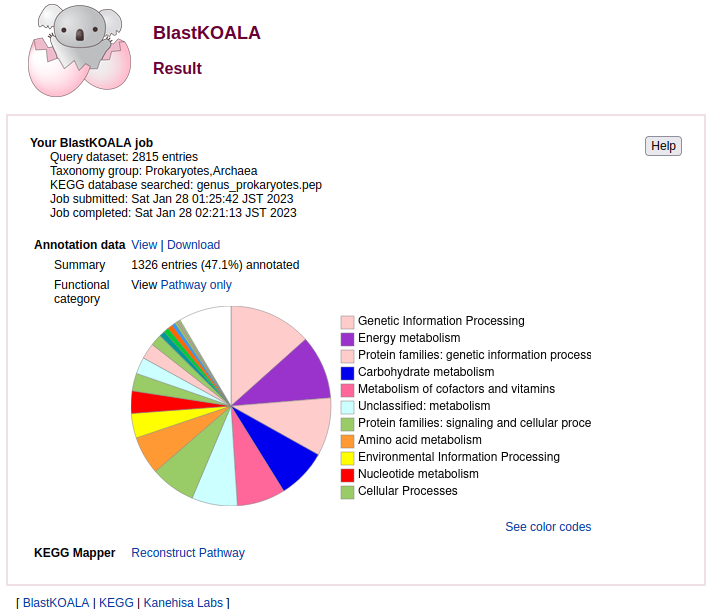

- Reconstruct its pathways and check out what it can do.

- Question: Can the organism do methanogenesis?

Answer: Yes, the methanogenesis pathway shows up in Blast Koala.
    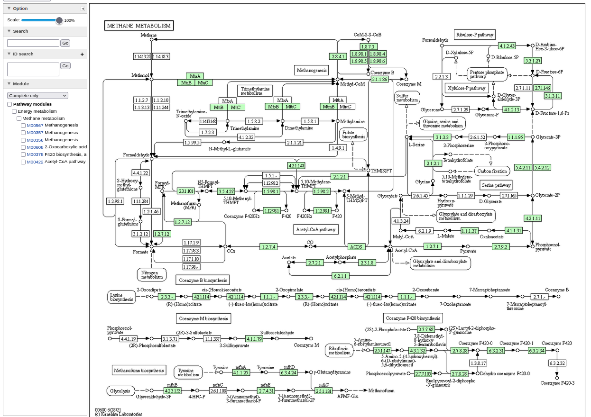

- Does it have genes similar to a bacterial secretion system?
  Yes some genes for the bacterial sercretion system are present.
    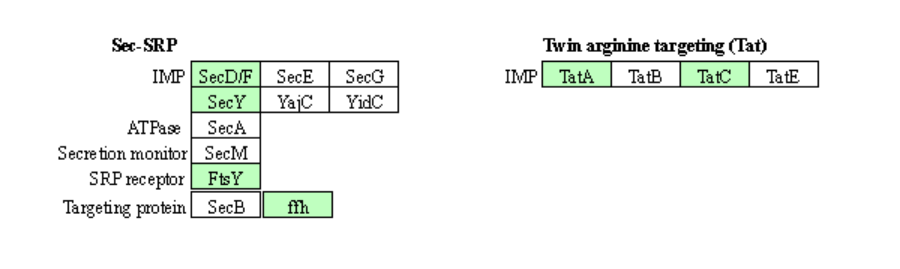


# RNA-Seq

## Central dogma
DNA -> RNA -> Protein
   - DNA: deoxyribonucleic acid (genetic material)
   - RNA: ribonucleic acid (messenger)
   - Protein: amino acid chain (functional)


- optimal read length: 50 bp single end, 100 bp paired end
- optimal replicate number: 3-5


## RNA-Seq workflow
1. Extract RNA
2. Produce cDNA
3. Sequencing
4. Bioinformatics
5. Analysis

## 1. Extract RNA
- RNA is extracted from cells

## 2. Produce cDNA
- cDNA is produced from RNA using reverse transcription

## 3. Illumina sequencing
Illumina sequencing is a method to sequence DNA or RNA. It is based on the principle of sequencing by synthesis. The DNA or RNA(cDNA) is fragmented into small pieces and the fragments are attached to a flow cell. The flow cell is then placed in a sequencing machine. The sequencing machine uses a laser to read the DNA fragments by recording the fluorescent signal of the attached nucleotides. The sequencing machine can read millions of DNA fragments in parallel.

## Alternatively download sequenced data from papers
- Go to paper
- Search for key words (SRA, SRR, accession number)
- Follow link to NCBI SRA (https://www.ncbi.nlm.nih.gov/geo/query/acc.cgi?acc=GSE85456)
- Navigate to SRA and extract SRR numbers of interest
- Import the data into your computer with the following command:
```
#Samples 
fasterq-dump SRR***, SRR***, SRR***, SRR***
#Metadata
grabseqs sra -l -t 4 -m metadata.csv SRP081251
```

  - SRR numbers 
    - SRR4018517
    - SRR4018516
    - SRR4018515
    - SRR4018514

## 4. Bioinformatics
The bioinformatics workflow is similar to the sequencing pipeline described above. However, in this case we automate the process by using a program called READemption. READemption is a pipeline for the analysis of RNA-Seq data, it is a wrapper for several other programs.

Before we start the READemption pipeline, we might have to perform quality control and clean up if the data is unprocessed. For this we use **[fastqc](https://home.cc.umanitoba.ca/~psgendb/doc/fastqc.help)** and **[fastp](https://github.com/OpenGene/fastp#fastp)**. Then we can create the folder structure neccessary for READemption and move the data into the correct folders. We use the following command to create the folder structure:
```
reademption create --project_path READemption_analysis --species salmonella="Salmonella Typhimurium"
```
Lastly we need to make sure that the data has the correct format and headers. 
Ater that all steps are executed in one batch script by READemption.

  [Batch script used in course](https://github.com/YanGiencke/biol217/blob/main/scripts/READemption.sh)


# Introduction to R
R is a programming language and software environment for statistical computing and graphics. In a short introduction we learned the basics of R and how to use it for data visualization.
We used the following code:
```
# Title: Introduction to R

# To print a value, use the print() function.
print("Hello, world!")

# To print a value without the print() function, use the value itself.

# to show the current working directory, use the getwd() function.
getwd()

# To create a new directory, use the dir.create() function.
# dir.create("data")
# dir.create("data/raw_data")

# R has 5 basic data types: logical, integer, numeric, complex, and character.
# To assign a value to a variable, use the assignment operator, <-.
x <- 1:10
t <- TRUE

# To create a sequence of numbers, use the colon operator, :.
z <- 1:10

# To create a sequence of numbers with a step size, use the seq() function.
w <- seq(1, 10, by = 2)

# Data types
# To check the data type of a variable, use the class() function.
class(x) # numeric
class(t) # logical

# To check the length of a variable, use the length() function.
length(x)

# R has 3 basic data structures: vectors, matrices, and data frames.
# To create a vector, use the c() function.
y <- c(1, 2, 3, 4, 5)

# To create a matrix, use the matrix() function.
m <- matrix(1:9, nrow = 3, ncol = 3)

# To create a data frame, use the data.frame() function.
df <- data.frame(x = 1:10, y = 1:10)

# R operators
# Mathematical operators: +, -, *, /, ^, %%
# Logical operators: >, <, >=, <=, ==, !=
# Logical operators: &, |, !


# Test your knowledge
# using iris dataset
data("iris")
View(iris)

plot(iris)

boxplot(iris$Sepal.Length ~ iris$Species)

setwd("/home/kurs/Desktop/biol217/R/intro")


# install.packages("ggplot2")
# install.packages(c("readxl", "plotly"))
install.packages("tidyverse")
install.packages("svglite", dependencies = TRUE)
library(ggplot2)
library(svglite)

setRepositories()

# Plotting with ggplot2
ggplot(iris, aes(x = Sepal.Length, y = Sepal.Width, color = Species, size = Petal.Length*Petal.Width)) +
  geom_point()

plot1 <- ggplot(iris, aes(x = Sepal.Length, y = Sepal.Width, color = Species, size = Petal.Length*Petal.Width)) +
  geom_point()

# Saving plots as different files
ggsave("Iris.tiff", plot1, width = 20, height = 10, unit = "cm", dpi = 300)

ggsave("Iris_compressed.tiff", plot1, width = 20, height = 10, unit = "cm", dpi = 300, compression = "lzw")

ggsave("Iris2.pdf", plot1)

ggsave("Iris2.svg", plot1)

svglite("Iris.svg", width = 20, height = 10, pointsize = 12)


# Reshaping data with tidyr
library(tidyr)
library(plotly)
library(readxl)


# spread iris dataset to wide format using tidyr spread() function
new_table <- spread(data = iris, key = iris$Species, value = c(iris$Sepal.Length, iris$Sepal.Width, iris$Petal.Length, iris$Petal.Width))


# visualizing distribution
hist(iris$Sepal.Length)
hist(iris$Sepal.Width)
hist(iris$Petal.Length)
hist(iris$Petal.Width)

# visualizing outliers
boxplot(iris$Sepal.Length)
boxplot(iris$Sepal.Width)
boxplot(iris$Petal.Length)
boxplot(iris$Petal.Width)

# Statistical analysis of normal distributed data
# 1 sample t-test
# 2 sample t-test
# more than 2 samples ANOVA


# More plotting with ggplot2
data()
View(DNase)

ggplot(DNase, aes(x = conc, y = density)) + geom_point()
 + xlab("Concentration") + ylab("Density") + ggtitle("DNase I activity")
  + ggsave("DNase.jpg")

ggplot(DNase, aes(x = conc, y = density)) + geom_point() + ggsave("DNase.jpg")
hist(DNase$density)
hist(DNase$conc)
```	
The following plots were created:


# RIBO-Seq

## What is Ribo-Seq?
Central dogma of molecular biology: DNA -> RNA -> **Translatome** -> Protein
The Translatome is the mRNA bound to ribosomes. 
Simillar to RNA-Seq the mRNA is sheared but only the regions with ribosomes attached are sequenced. This is called Ribo-Seq.
Since the ribosomes only bind to the coding regions of the mRNA, the Ribo-Seq data can be used to identify the genes that are actually being expressed.
In combination with RNA-Seq data, the Ribo-Seq data can be used to identify the genes that are being translated.

Ribosome protected fragments (RPFs) are about 25–40 bp in length.

In the course we used data fron the paper: [Role of CsrA in stress responses and metabolism important for Salmonella virulence revealed by integrated transcriptomics](https://www.ncbi.nlm.nih.gov/pmc/articles/PMC6347204/pdf/pone.0211430.pdf). The image below shows the experimental design from the paper.
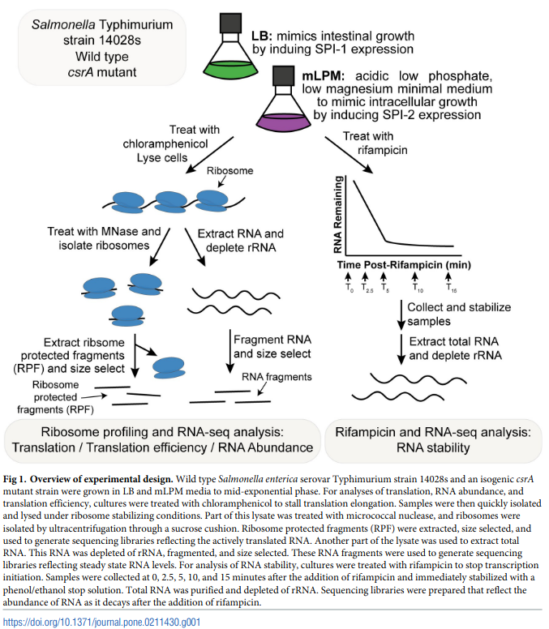


## Integrated Genome Browser (IGB)
The Integrated Genome Browser (IGB) is a program used for analysing differential gene expression based on RNA-Seq and RIBO-Seq data. To use the program we need to load the fasta files for the genome and the annotation file (.gff). Then we can load the coverage files (.bw). 
The following picture shows the differential expression of the csrA gene in the wildtype and Mutant strain described in the paper.

The csrA gene starts at base pair 2991371 and ends at 2991185.In Integerated Genome Browser we can visualize the differential expression of genes between the two conditions.

Information about the csrA gene:
1. Start Codon: ATG
2. Stop Codon: TAA
3. Length in Amino Acids: 61 (does not include stop codon)
4. Shine-Dalgarno sequence (consensus AGGAGG at -7 to -4): AGGAG at -7
5. Upsream gene: alaS (STM14_3413)
6. Is the csrA gen translated? Yes, because the RIBO-Seq data covers the whole gene.

## R code for RIBO-Seq analysis
Using R we can identify more differentially expressed genes and visualize the expression in a heatmap. The following code was used create the heatmap.
```
library(readxl)
library(ggplot2)

sheet1 <- read_excel("csrA-WT_sorted.xlsx", sheet = "Sheet4")
plot1 <- ggplot(sheet1, aes(Seq_type, Name, fill=log2fold_change))+geom_tile() +
  ylab("Genes") +xlab("Sequencing Type")+ labs(fill="Change in log2") + ggtitle("Differential gene expression") + 
  geom_text(aes(label=Name))+theme(axis.text.y = element_blank()) + ggsave("Differential_gene_expression1.png")

plot1

ggsave("Differential_gene_expression1")
```

```
sheet2 <- read_excel("csrA-WT_sorted.xlsx", sheet = "Sheet3")
plot2 <- ggplot(sheet2, aes(Name, log2FC_TE_final))+geom_bar(stat = "identity") +
  xlab("Genes") +ylab("Change in log2")+ ggtitle("Differential gene expression") + 
  theme(axis.text.x = element_text(angle = 90, hjust = 1))
plot2

ggsave("Differential_gene_expression2.png")
```

```
sheet3 <- read_excel("csrA-WT_sorted.xlsx", sheet = "Sheet5")
plot3 <- ggplot(sheet3, aes(Seq_type, Identifier, fill=log2FC))+geom_tile()+
  ggtitle("Differential gene expression")+ylab("Genes") +xlab("Sequencing Type")+ 
  labs(fill="Change in log2")+theme(axis.text.y = element_blank())
plot3

ggsave("Differential_gene_expression3.png")
```

