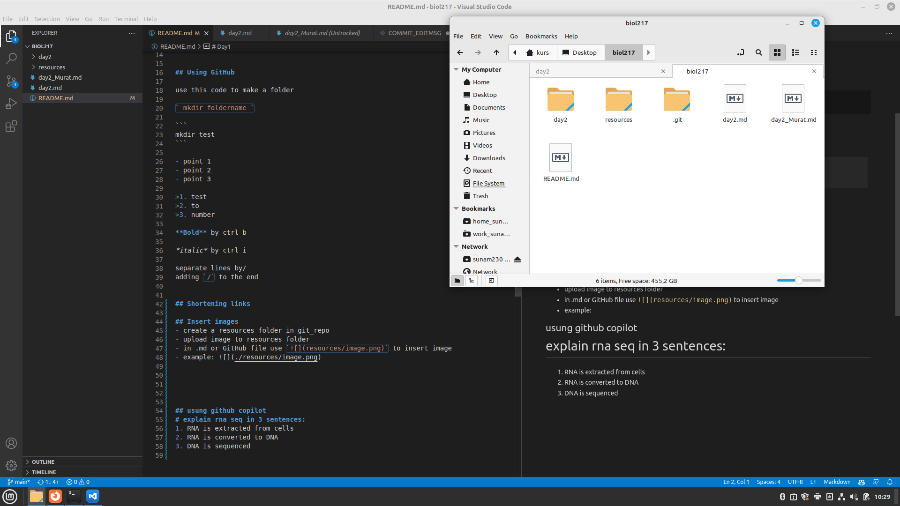

# biol217
# Day1 
## Introduction to linux

To get started open the console by pressing ctrl + alt + T.

To move to different directories use `cd "path/"`, for example:
```
cd Desktop
```
to move to the Desktop.


## Using GitHub


## Inserting code
To insert code, use the following syntax:
```
`code`
```


use this code to make a folder

` mkdir foldername `

```
mkdir test
```

- point 1
- point 2
- point 3

>1. test
>2. to
>3. number
   
**Bold** by ctrl b

*italic* by ctrl i

separate lines by/
adding `/` to the end


## Shortening/hiding links
To include a link in a document, use the following syntax:
`[link text](https://www.example.com)`

For example, to link to the [Google homepage](https://www.google.com), you would use the following syntax:
`[Google](https://www.google.com)`

## Insert images
- create a resources folder in git_repo
- upload image to resources folder
- in .md or GitHub file use `` to insert image
- example: 

