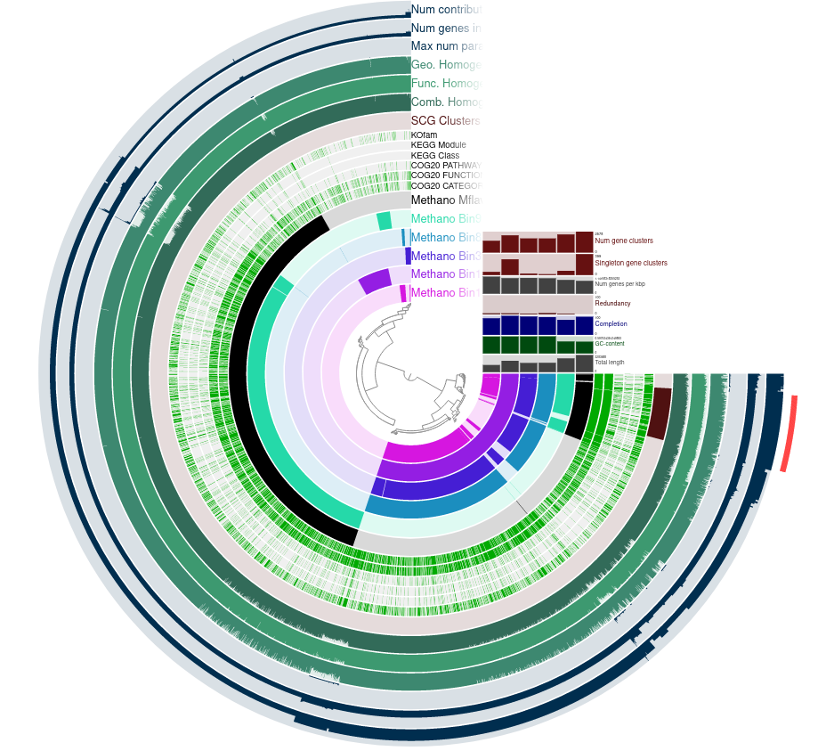
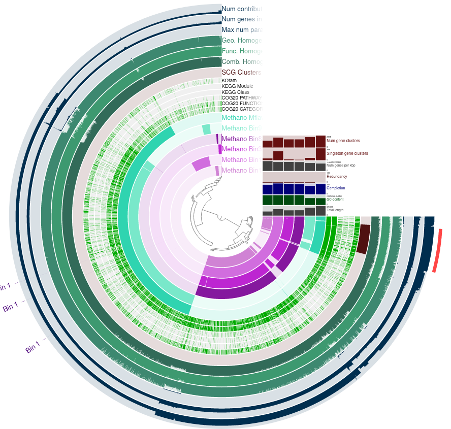
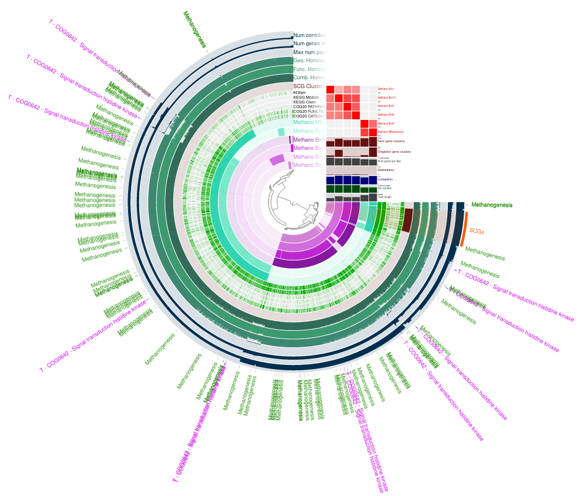
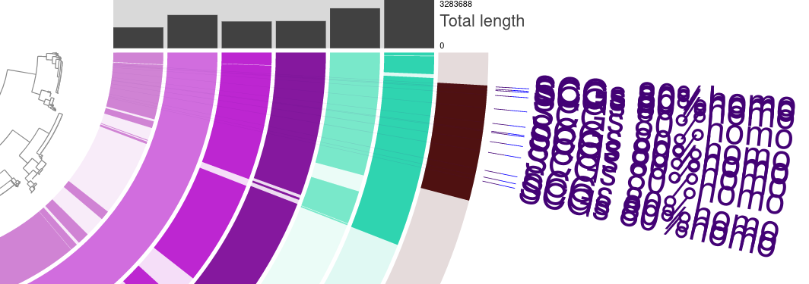

# Pangenomes

# Phylogenetics


# Anvio interactive
code: 
```
#get direct access to a HPC compute node
srun --reservation=biol217 --pty --mem=10G --nodes=1 --tasks-per-node=1 --cpus-per-task=1 /bin/bash

#activate the conda environment
conda activate /home/sunam225/miniconda3/miniconda4.9.2/usr/etc/profile.d/conda.sh/envs/anvio-7.1

#move to working directory
cd /path/to/

# start anvi'o interactive display(-P set the port)
anvi-display-pan -g *-GENOMES.db -p *-PAN.db -P 8089

# start tunnel in new Terminal(adjust port from pevious step & node)
ssh -L 8060:localhost:8089 sunam230@caucluster-old.rz.uni-kiel.de
ssh -L 8089:localhost:8089 node010

#open with link in browser:
http://127.0.0.1:8060
```

# Questions
Task: Take some time to click through the views and compare the MAGs. Add a screenshot of your output to your documentation. Answer the following Questions:

Question: How do the MAGs compare in size and number of contigs to the full genome?

Answer: The MAGs are much shorter. For example N50 shows the average length of fragments in different Bins. Here "Methano_Bin13: 22,585" is much better than "Methano_Bin5: 4,826"

|Contigs Stats|	Methano_Bin10	| Methano_Bin13|	Methano_Bin1|	Methano_Bin3	|Methano_Bin5|	Methano_Bin8|	Methano_Bin9|	Methano_Mflavescens|
|----|----|----|----|----|----|----|----|----|
|N50|	4,894|	22,585|	5,434|	13,114|	4,826|	19,343|	13,691|	3,283,688|


Question: Based on the contig numbers, sizes and number of marker genes (HMM hits), which two MAGs are the best and which is the worst?

Answer:

Create an external genomes file:
external-genomes.txt

name	contigs_db_path
Methano_Bin1	/work_beegfs/sunam230/Day6/02_contigs-dbs/Bin1.db
Methano_Bin10	/work_beegfs/sunam230/Day6/02_contigs-dbs/Bin10.db
Methano_Bin13	/work_beegfs/sunam230/Day6/02_contigs-dbs/Bin13.db
Methano_Bin3	/work_beegfs/sunam230/Day6/02_contigs-dbs/Bin3.db
Methano_Bin5	/work_beegfs/sunam230/Day6/02_contigs-dbs/Bin5.db
Methano_Bin8	/work_beegfs/sunam230/Day6/02_contigs-dbs/Bin8.db
Methano_Bin9	/work_beegfs/sunam230/Day6/02_contigs-dbs/Bin9.db
Methano_Mflavescens	/work_beegfs/sunam230/Day6/02_contigs-dbs/Mflavescens.db

Question: How do the bins compare to isolate genomes? Would you remove one, based on the output of the completeness estimation?

ANSWER:
Bin10 & Bin5 are below 70% completeness so we remove them.
external-genomes-final.txt

╒═════════════════════╤══════════╤══════════════╤════════════════╤════════════════╤══════════════╤════════════════╕
│ genome name         │ domain   │   confidence │   % completion │   % redundancy │   num_splits │   total length │
╞═════════════════════╪══════════╪══════════════╪════════════════╪════════════════╪══════════════╪════════════════╡
│ Methano_Bin1        │ ARCHAEA  │          0.8 │          86.84 │           5.26 │          275 │        1375677 │
├─────────────────────┼──────────┼──────────────┼────────────────┼────────────────┼──────────────┼────────────────┤
│ Methano_Bin10       │ ARCHAEA  │          0.3 │          56.58 │              0 │          286 │        1336430 │
├─────────────────────┼──────────┼──────────────┼────────────────┼────────────────┼──────────────┼────────────────┤
│ Methano_Bin13       │ ARCHAEA  │            1 │            100 │           5.26 │          182 │        2194666 │
├─────────────────────┼──────────┼──────────────┼────────────────┼────────────────┼──────────────┼────────────────┤
│ Methano_Bin3        │ ARCHAEA  │          0.9 │          96.05 │           3.95 │          180 │        1769119 │
├─────────────────────┼──────────┼──────────────┼────────────────┼────────────────┼──────────────┼────────────────┤
│ Methano_Bin5        │ ARCHAEA  │          0.3 │          43.42 │              0 │          334 │        1582595 │
├─────────────────────┼──────────┼──────────────┼────────────────┼────────────────┼──────────────┼────────────────┤
│ Methano_Bin8        │ ARCHAEA  │          0.9 │          93.42 │           6.58 │          145 │        1795577 │
├─────────────────────┼──────────┼──────────────┼────────────────┼────────────────┼──────────────┼────────────────┤
│ Methano_Bin9        │ ARCHAEA  │          0.8 │          78.95 │           2.63 │          255 │        2637263 │
├─────────────────────┼──────────┼──────────────┼────────────────┼────────────────┼──────────────┼────────────────┤
│ Methano_Mflavescens │ ARCHAEA  │            1 │          94.74 │              0 │          164 │        3283688 │
╘═════════════════════╧══════════╧══════════════╧════════════════╧════════════════╧══════════════╧════════════════╛


Scroll to the top of the help and find out which INPUT FILES you need. Write the command and use the additional flag -P. What is the -P flag for?

Answer: 
    INPUT: -p Pan-Genome.db -g Combined-Genomes.de 
    -P sets the port example: 8089

# Anvio interactive Tasks
TASKS: Genome similarity

- Remove combined homogeneity, functional homogeneity, geometric homogeneity, max num parsimonay, number of genes in gene cluster and number of genomes gene cluster has hits from the active view. Tip: Play with Height
- Create a "Bin-highlight" including alls SCGs and name it accordingly. How to?


- Cluster the genomes based on Frequency


- Question: 
  - Based on the frequency clustering of genes, do you think all genomes are related? Why?
  - Highlight your reference genome in one color, its closest relative in a similar one, and distict genomes in a third colour.
  - How does the reference genome compare to its closest bin? Tip: Consider the genome depiction and layers above

Answer: No. Only Bin 9 is closely related to the reference Methano Mflavescens. The other Bins are related to each other.




- Go to Layers and remove Num gene clusters, Singeltons, Genes per kbp and Total length from view. Add ANI_percentage_identity to the view and play with the threshold.

- Questions: What ranges are used determine a prokaryotic species? How high can you go until you see changes in ANI? What does the ANI clustering tell you about genome relatedness?

    Answer: 
    - over 95% identity for DNA from one species
    - differences between the two clusters appear upwards from 98%
    - The higher the saturation of a tupel, the higher the relatedness of the two Bins


# TASKS: Functional Profiling

- Using the Search Function, highlight all genes in the KEGG Module for Methanogenesis
    - Create a new bin called "Methanogenesis" and store your search results in this bin.
    - Question: How are Methanogenesis genes distributed across the genome?

    Answer: Through the whole Pangenome.


- Google COG Categories and select one you are interesed in. Create a new bin, find your Category in the Pangenome and add it to this selection.

    T - COG0642 - Signal transduction histidine kinase
    


- Save your state and export this view as .svg

[pangenome.svg](resources/pangenome.svg)


# TASKS: Functional/geometric homogeneity and their uses

- Using search parameters, find a gene which occurs:
    - in all genomes
    - a maximum of 1 times (Single copy gene)
    - has a high variability in its functional homogeneity (max. 0.80)

    This gene will be highly conserved, but has diversified in its AA make-up.

    Highlight the found genes on the interface. Inspect one of the gene-clusters more closely (Inspect gene-cluster).
    


Question: What observations can you make regarding the geometric homogeneity between all genomes and the functional homogeneity?

The AA sequences start later in some Bins these are not geometrically homogenous
    


# BONUS: BlastKoala

Outside of anvi'o there are a range of tools available to investigate your organisms metabolism. One of these is BlastKOALA, which generates a metabolic profile of your genome based on the KEGG database.

- Task: Check out the BlastKOALA Results for this Methanogen.
    

- Reconstruct its pathways and check out what it can do.

- Question: Can the organism do methanogenesis?

Answer: Yes, the methanogenesis pathway shows up in Blast Koala.
    

- Does it have genes similar to a bacterial secretion system?
  Yes some genes for the bacterial sercretion system are present.
    
