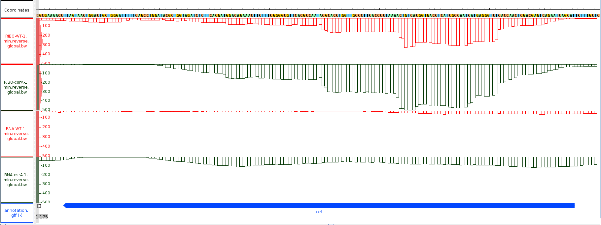

# RNA-Seq and Ribo-Seq

## Summary
1. What is Ribo-Seq?
2. Using a geome browser
3. How to identify genes

## What is Ribo-Seq?
Central dogma of molecular biology: DNA -> RNA -> **Translatome** -> Protein
The Translatome is the mRNA bound to ribosomes. 
Simillar to RNA-Seq the mRNA is sheared but only the regions with ribosomes attached are sequenced. This is called Ribo-Seq.
Since the ribosomes only bind to the coding regions of the mRNA, the Ribo-Seq data can be used to identify the genes that are being expressed.
In combination with RNA-Seq data, the Ribo-Seq data can be used to identify the genes that are being translated.

Ribosome protected fragments (RPFs) are about 25–40 bp in length.

### [Paper](https://www.ncbi.nlm.nih.gov/pmc/articles/PMC6347204/pdf/pone.0211430.pdf)

Abstract
To cause infection, Salmonella must survive and replicate in host niches that present dra-
matically different environmental conditions. This requires a flexible metabolism and physi-
ology, responsive to conditions of the local milieu. The sequence specific RNA binding
protein CsrA serves as a global regulator that governs gene expression required for patho-
genicity, metabolism, biofilm formation, and motility in response to nutritional conditions. Its
activity is determined by two noncoding small RNAs (sRNA), CsrB and CsrC, which seques-
ter and antagonize this protein. Here, we used ribosome profiling and RNA-seq analysis to
comprehensively examine the effects of CsrA on mRNA occupancy with ribosomes, a mea-
sure of translation, transcript stability, and the steady state levels of transcripts under in vitro
SPI-1 inducing conditions, to simulate growth in the intestinal lumen, and under in vitro SPI-
2-inducing conditions, to simulate growth in the Salmonella containing vacuole (SCV) of the
macrophage. Our findings uncovered new roles for CsrA in controlling the expression of
structural and regulatory genes involved in stress responses, metabolism, and virulence
systems required for infection. We observed substantial variation in the CsrA regulon under
the two growth conditions. In addition, CsrB/C sRNA levels were greatly reduced under the
simulated intracellular conditions and were responsive to nutritional factors that distinguish
the intracellular and luminal environments. Altogether, our results reveal CsrA to be a flexi-
ble regulator, which is inferred to be intimately involved in maintaining the distinct gene
expression patterns associated with growth in the intestine and the macrophage.

In Integerated Genome Browser we can visualize the differential expression of genes between the two conditions.

1. Start Codon: ATG
2. Stop Codon: TAA
3. Length in Amino Acids: 61

Alternative start codons
Alternative start codons are different from the standard AUG codon and are found in both prokaryotes (bacteria and archaea) and eukaryotes. Alternate start codons are still translated as Met when they are at the start of a protein (even if the codon encodes a different amino acid otherwise). This is because a separate transfer RNA (tRNA) is used for initiation.